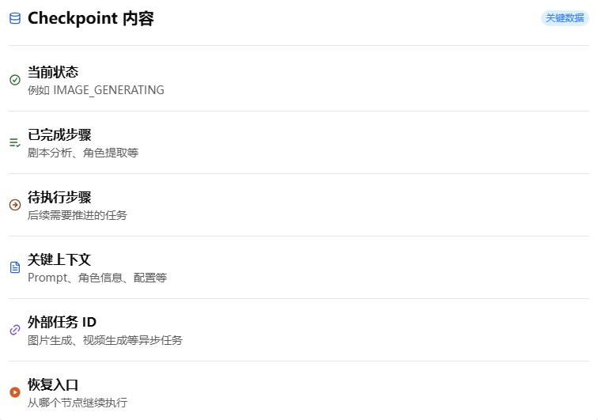

# Checkpoint: 为什么 Long Running Agent 需要断点回复？
> 当 Agent 的生命周期跨越数小时甚至数天后，状态保存不再是优化，而是基础能力。

Long Running Agent 最大的风险不是推理失败，而是任务在任意时刻都可能中断，而 Agent 必须能够从中断点继续完成目标。

## 前言：Long Running 最大的风险是什么？
在上一篇文章中，我们讨论了 Long Running Agent 的核心特点：Agent 不再围绕一次请求运行，而是围绕一个持续推进的目标运行。

这意味着，一个 Agent 的生命周期可能跨越数小时、数天，甚至更长时间。期间它可能等待异步任务完成、等待人工审核、等待外部系统回调，也可能因为服务发布、节点故障或网络异常而中断。

于是，一个新的问题出现了：
> 如果 Agent 在执行过程中中断，它如何继续完成剩余任务？

对于传统请求式程序来说，中断通常意味着重新执行。但对于 Long Running Agent 来说，重新开始往往意味着巨大的资源浪费，甚至会导致任务状态不一致。

因此，企业级 Agent 不仅需要知道“当前执行到哪里”，更需要知道“中断之后如何继续执行”。

这正是 Checkpoint 要解决的问题。在我看来，状态机让 Agent 知道自己在哪里，而 Checkpoint 则让 Agent 在中断之后，仍然能够继续向目标前进。

本文将结合 AI 短剧系统的实践，聊聊为什么 Checkpoint 不是 Long Running Agent 的一个优化选项，而是支撑其可靠运行的基础能力。

## 1. 什么是 Checkpoint？
很多人第一次接触 Checkpoint 时，会把它理解为“保存当前状态”。

但对于 Long Running Agent 来说，仅仅保存状态并不够。

例如，一个短剧项目已经完成了：
```
剧本分析
角色提取
分镜生成
Prompt 优化
```

此时系统发生重启，如果 Agent 只知道当前状态是 `IMAGE_GENERATION`, 它依然无法确定：
- 哪些图片已经提交？
- 哪些任务仍在队列中？
- 哪些步骤需要重新执行？
- 恢复后应该从哪里继续？

因此，Checkpoint 真正保存的，并不是一个简单的状态值，而是 Agent 可以继续执行所需的最小上下文。

从工程角度来看，Checkpoint 更像是一次“可恢复快照（Recoverable Snapshot）”。

它记录的是：
- 当前任务所处阶段；
- 已经完成的工作；
- 尚未完成的工作；
- 恢复执行所需的关键上下文。

只有具备这些信息，Agent 才能在中断后继续完成目标，而不是被迫重新开始。

## 2. 为什么 Long Running Agent 一定会中断？
在传统请求式程序中，我们通常把中断视为异常情况。

但在 Long Running Agent 中，中断更像是一种常态。

以 AI 短剧系统为例，一个完整的任务可能会经历：
```
提交图片生成任务
    ↓
等待 GPU 资源
    ↓
生成结果回调
    ↓
人工审核
    ↓
继续后续流程
```
其中任何一个阶段，都可能导致任务暂停。

常见原因包括：
- GPU 队列等待；
- 视频生成超时；
- 第三方服务限流；
- 人工审核等待；
- 系统升级或节点迁移。

这些情况并不意味着任务失败，而只是 Agent 暂时无法继续推进目标。

也正因为如此，Long Running Agent 的设计前提不再是“如何避免中断”，而是“如何在中断后继续执行”。

一旦接受了这一点，Checkpoint 就不再是一个可选优化，而成为 Long Running 架构中的基础能力。

## 3. Checkpoint 保存什么？
很多系统会把 Checkpoint 简化为一个 `status` 字段。

例如：
```
IMAGE_GENERATING
```
但真正的 Checkpoint 至少需要回答两个问题：
> 1. Agent 已经做了什么？
> 2. Agent 接下来应该做什么？

因此，在一个真实的 Long Running Agent 中，Checkpoint 通常会包含：


这里有一个非常重要的区别：
> 状态（State）描述的是“现在在哪里”，而 Checkpoint 描述的是“如何继续前进”。

因此，Checkpoint 保存的不是过去，而是未来。

它决定了 Agent 在恢复执行时，能否准确的衔接后续任务，而不是重复已经完成的工作。

## 4. Checkpoint 如何改变 Agent 设计？
在没有 Checkpoint 的情况下，Agent 的设计通常围绕一次请求展开：
```
 Request
    ↓
 Memory
    ↓
 Response
```
所有上下文都存在于当前执行进程。

一旦进程结束，执行状态也随之消失。

而引入 Checkpoint 之后，Agent 的运行模式发生了变化：
```
  Goal
    ↓
  State
    ↓
 Checkpoint
    ↓
  Resume
    ↓
 Continue Goal
```
此时，Agent 不再依赖单次执行过程，而是依赖**可恢复的任务生命周期**

这会带来一个非常重要的架构变化：
> Agent 开始从“无状态推理”演进为“可恢复任务”。

过去，系统更关注模型能否正确推理；现在，系统同样需要关注任务能否在任意时刻恢复执行。

也正以为如此，Checkpoint 往往会成为 Agent Runtime 中的核心能力之一。

它不仅负责保存执行进度，更负责连接“暂停之前的 Agent”和“恢复之后的 Agent”。

对于企业级 Long Running Agent 来说，这种连接能力，往往比一次推理的结果更加重要。

## 总结

从状态机到 Long Running，再到 Checkpoint，我们会发现一个明显的变化：

Agent 关注的已经不再是一次请求，而是一个持续推进的目标。

当任务的生命周期跨越多个阶段、多个系统，甚至跨越服务重启和人工介入时，Agent 必须能够在中断之后继续前进。

这也是 Checkpoint 真正的价值所在。

它保存的不是一份简单的执行记录，而是 Agent 继续完成目标所需要的上下文、进度和恢复入口。

状态机让 Agent 知道自己在哪里，而 Checkpoint 则让 Agent 在中断之后，仍然能够从正确的位置继续执行。

从工程角度来看，Checkpoint 的出现意味着 Agent 开始从“无状态推理”演进为“可恢复任务”。

过去，我们更关注模型是否足够智能；而现在，我们同样需要关注任务是否能够稳定运行、可靠恢复，并最终完成目标。

在我看来，这也是企业级 Agent 与演示型 Agent 之间的重要区别之一。

下一篇文章，我将继续讨论 Long Running Agent 中另一个关键能力——Human-in-the-loop。

当 Agent 需要等待人类决策时，任务生命周期会如何变化？人工介入之后，又如何保证整个目标能够继续推进？

这也是 Agent 从“自动执行”走向“人机协同”过程中必须解决的问题。
