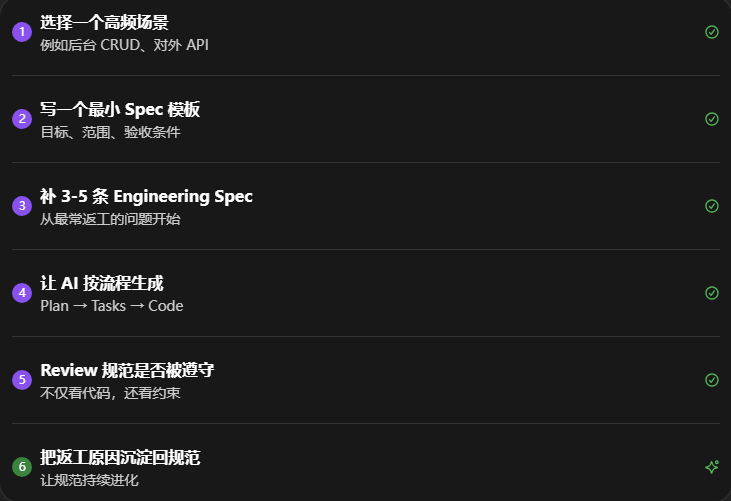

# Prompt 已经过时了吗？聊聊 Specification-Driven Development

最近一年，AI Coding 工具的发展速度非常惊人。

Cursor、Claude Code、Codex、opencode……越来越多的开发者开始习惯用自然语言描述需求，让 AI 帮我们写代码、改代码、解释代码。

这种“Vibe Coding”的体验非常强。

但在真实项目中，我逐渐发现一个问题：

> AI 会写代码，但它不一定会按团队的方式写代码。

同一个需求，今天生成一种结构，明天又生成另一种结构；这次按 REST 风格写接口，下次换了返回格式；提醒它写日志，它这次记住了，下次又忘了；测试有时完整，有时只覆盖 happy path。

问题已经不是“AI 会不会写代码”，而是：

> AI 能否稳定、持续、可协作地按团队规范写代码？

### 为什么 AI 每次写出来都不一样？

我认为根本原因是：工程上下文还没有资产化。

很多团队其实有大量隐性规则：

* 接口返回格式

* 错误码结构

* 日志字段

* 目录组织

* 测试覆盖要求

* 数据库迁移规范

但这些规则往往散落在：

* Code Review 习惯里

* 老同事脑子里

* 历史 PR 中

* 几次聊天记录里

AI 并不会天然知道这些规则。

如果规则没有沉淀成可以被读取、被引用、被版本化的资产，AI 每次都只能根据当前 Prompt 猜测。

### 从个人效率到团队能力

我现在越来越认同一句话：

> 个人用 AI，拼的是 Prompt；团队用 AI，拼的是 Specification。

Prompt 适合：

* 探索

* 问答

* 临时脚本

* 局部修改

而团队更关心：

* 一致性：同类接口风格统一

* 可审查：设计决策有依据

* 可交接：换人后仍能继续开发

* 可回溯：需求到实现的链路可追踪

这些能力，仅靠一次性的 Prompt 很难长期维持。

### Specification-Driven Development 的历史脉络

很多人以为 Spec Coding 是 AI 时代的新概念，其实它有很长的历史。

它们的共同点都是：

> 先定义系统应该做什么，再让实现跟随规范。

区别在于，过去规范主要给人读；现在规范不仅给人读，也给 Agent 读。

### 我理解的四层上下文模型

在项目实践中，我把 AI Coding 的上下文拆成四层：

1. Constitution: 不可违反的工程原则
2. Specification: 功能目标、业务边界、验收条件
3. Plan: 技术路线与架构取舍
4. Tasks: 执行步骤与检查点

很多 AI Coding 的混乱，来自于把这四层内容全部塞进一次 Prompt 里。

拆开之后，团队和 Agent 都会更清楚：哪些是长期原则，哪些是本次实现的计划。

### 当前主流方案：Spec Kit、OpenSpec 与 Superpowers

| 层次     | 代表方案                              |
| ------ | --------------------------------- |
| 规范管理层  | GitHub Spec Kit、OpenSpec          |
| 执行工作流层 | Superpowers                       |
| 代码实现层  | Claude Code、Cursor、Codex、opencode |

它们不是互相替代，而是互相组合。

一个理想链路是：

### 我们项目中的真实实践

在我们的 AI 短剧项目中，其实已经有大量 Design 和 Plan 文档。

流程大致是：

但我们仍然遇到：

* 函数命名不统一

* 接口风格不统一

* 日志写法不统一

* 错误处理不统一

* 测试覆盖习惯不统一

这说明：业务需求和技术计划还不够，还需要 Engineering Specification。

### Engineering Specification：把团队习惯写下来

我们后来开始沉淀：

> naming.mdapi.mderrors.mdlogging.mdtesting.mddatabase.md

每个规范都包含：

* 正例

* 反例

* 检查方式

例如，不再写一句“日志要规范”，而是明确：
- 创建角色: INFO
- 删除角色: WARN
- 数据库异常: ERROR
- 调用外部 AI 服务失败： ERROR
- 日志必须包含：traceId, projectId, userId, requestId

这样 Agent 才知道什么叫“符合规范”。

### 如何开始落地 Spec-Driven Development？

我不建议一上来就写几十份规范文档。

更现实的路线是：

让规范持续进化

Spec-Driven Development 的关键，不是一次写完所有规范，而是让规范持续进化。

### 最后的总结

今天我最想表达的，是三个层次：

当代码生成越来越便宜，真正稀缺的能力会变成：

* 定义问题

* 组织上下文

* 表达约束

* 设计验收标准

* 让 AI 稳定执行

未来最重要的开发者，不一定是写代码最快的人，而是最会定义规范的人。
